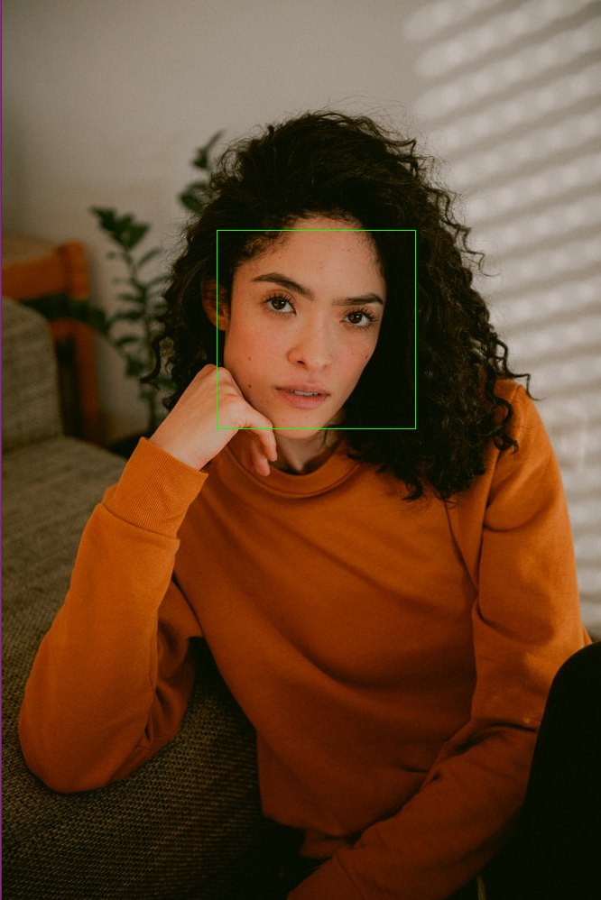

## Face Detection 

### Requirements
python3

### Setup
[optional] create a python virtual environment

`python -m venv env`

Install opencv for python

`pip install opencv_python`

### Commands
`python face_detect.py --image path_to_image --neighbors integer`

### Example
`python face_detect.py --image images/img_3.jfif`
 

